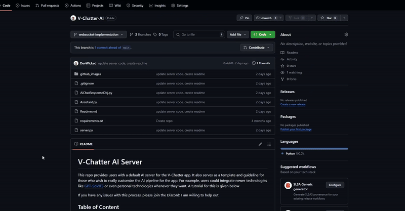
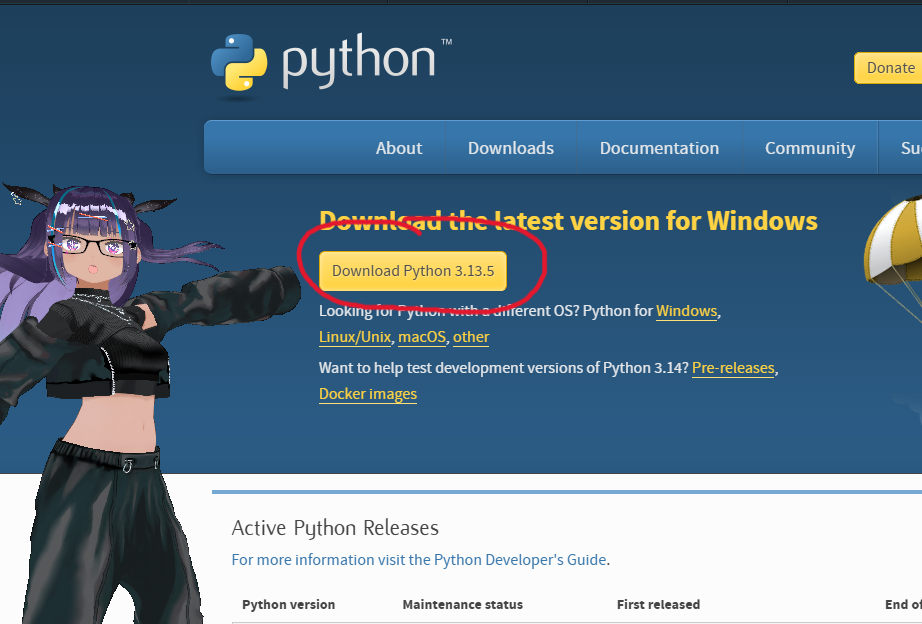
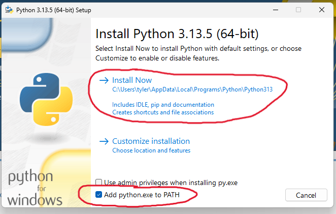
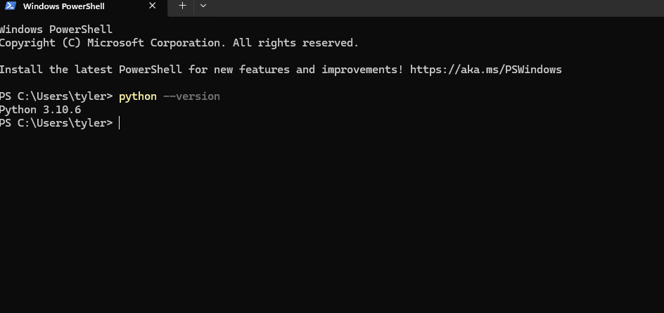
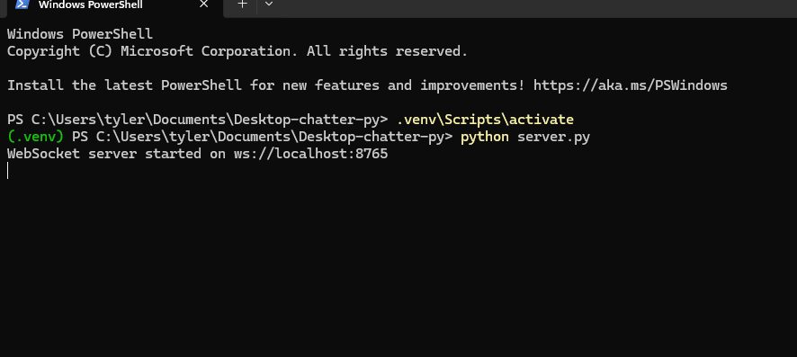

# V-Chatter AI Server
This repo provides users with a default AI server for the V-Chatter app. It also serves as a template and guideline for those who wish to really customize 
the AI pipeline for the app. For example, users could integrate newer technologies like [GPT-SoVITS](https://github.com/RVC-Boss/GPT-SoVITS) or even personal technologies
whenever they want. A tutorial for this is given below

If you have any issues with this process, please join the Discord! I am willing to help out

## Translation (Español, 日本語, 中国人, 中國人, 한국인)
Please use Google Chrome's or your web browser's translation feature

## Table of Content
- [Python Installation](#python-installation)
- [Inputting Configuration](#inputting-configuration)
- [Running the AI Server](#running-the-ai-server)
- [(Extra) Developer guide; Integrating Preferred Technologies](#developer-guide-integrating-preferred-technologies)

## Python Installation
The first thing you need to do is install Python onto your computer. If you have it installed already, you can skip this section

Let's begin by going to the [official python website](https://www.python.org/downloads/). 
Once at the downloads page, you can click on the big yellow download Python button to get the latest version.

Click on the downloaded .exe file to open the installation wizard. Make sure that you toggle on the **Add python.exe to PATH** and then click on install now. Note: If you are unsure about how to proceed through the installation wizard, I recommend watching this very short [YouTube video](https://www.youtube.com/watch?v=YKSpANU8jPE). 

To verify if Python was successfully installed, type in the command: ***python --version*** into your terminal. You should see something like what is shown below. 

## Inputting Configuration
Open the server.py file with your favorite text editor (e.g. Notepad, VSCode, etc.) and follow the instructions in the file to properly set up your server with desired settings. For information on how to get API keys and the such, please read the Itch.io chat tutorial in the app. 

Quick note: if you see a line with the word **str** in it, you have to enclose your value in quotation marks. For example, AI_personality: str = "you are a laid back dude". If you see a line with the word **int** in it, your value has to be a positive integer that is NOT enclosed in quotation marks. For example, context_limit: int = 5

## Running the AI Server
Note: running the server requires you to use the Windows terminal and you can't close it, otherwise it will stop running. You can minimize it, but you can't quit it if you want to keep it running. If you want it to stop running, you can either press ctrl + c or close the terminal

### First Time Setup
1. Launch the terminal inside the folder where this project is located on your computer
2. Create a virtual environment by running the command: ***python -m venv .venv***
3. Activate your virtual environment by executing the command: ***.venv\Scripts\activate***
4. Download the required libraries by running the command: ***pip install -r .\requirements.txt***
5. Start the server using the command: ***python server.py***

###  Running the Project Again
Running the project again after the first time requires less steps!
1. Launch the terminal inside the folder where this project is located on your computer.
2. Activate your virtual environment by executing the command: ***.venv\Scripts\activate***
3. Start the server using the command: ***python server.py***

The server running in the terminal should look like this no matter which time it is ran

## Developer guide; Integrating Preferred Technologies
**This section is optional and only for coders!** I tried to make this process as easy as possible for you guys. There are only three functions you need to modify in the Assistant.py file to integrate whatever AI technologies you want. They are located at the bottom of the file. I will now be going through each of them in detail

### generateResponse()
This function is responsible for generating the response from the large language model. It takes in as input the latest message the user sent in the form of a dictionary. The properties currently present are content, name, and role. I recommend leaving in the removal of the name property since the time stamp is stored in there (for message deletion purposes) and it might mess up the model you're using if it requires a ChatGPT completion like call with context. Make sure the function returns a string of the response, or an empty string if it fails.

### generateTtsMP3()
This function is responsible for generating the text to speech audio for your AI's response. It takes in the AI response as an argument for the sole purpose of converting that text to audio. It saves the audio into a file named **generated_audio.mp3** for the application to play; always check that it's present in your chat data save folder. Return true if the audio is created and false if it fails. 

### transcribeUserSpeech()
This function is responsible for converting your speech input audio to text for the language model to respond to. It should inspect the audio from the **user_recording.wav** file. This file is present in your chat data save folder as the client app makes it for you. Return the transcribed text if successful, otherwise return \*failed\*. 

If you have questions that go deeper into the implementation, feel free to direct message me
